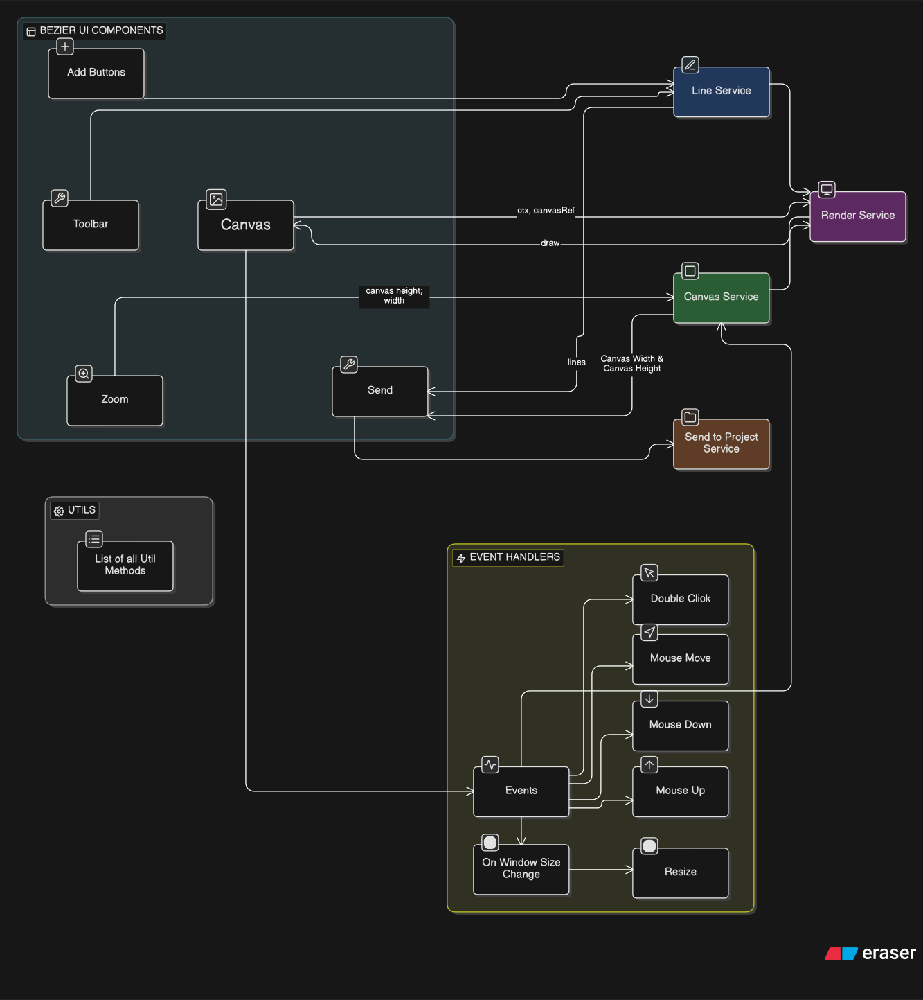

# Bezier Curves & Lines

An Angular-based application for drawing and manipulating Bezier curves and lines with an interactive canvas interface.

## Project Structure

```
beziercurveslines
├── .vscode/                          # VS Code configuration
│   ├── extensions.json
│   ├── launch.json
│   └── tasks.json
├── src/
│   ├── app/
│   │   ├── core/                     # Core functionality
│   │   │   ├── models/               # TypeScript interfaces and models
│   │   │   │   ├── iframeMessage.model.ts
│   │   │   │   ├── line.model.ts
│   │   │   │   └── point.model.ts
│   │   │   └── services/             # Core services
│   │   │       ├── BzCanvas.Service.ts          # Canvas management
│   │   │       ├── BzLine.Service.ts            # Line operations
│   │   │       ├── BzRender.Service.ts          # Rendering logic
│   │   │       ├── BzSendToProject.Service.ts   # Project integration
│   │   │       └── QlIframeMessageService.ts    # IFrame messaging
│   │   ├── features/                 # Feature modules
│   │   │   ├── canvas/               # Canvas drawing component
│   │   │   │   └── canvas.component.ts + html + css + spec
│   │   │   ├── main/                 # Main application component
│   │   │   │   └── main.component.ts + html + css + spec
│   │   │   ├── new-line/             # New line creation component
│   │   │   │   └── new-line.component.ts + html + css + spec
│   │   │   ├── send-to-project/      # Send to project component
│   │   │   │   └── send-to-project.component.ts + html + css + spec
│   │   │   ├── toolbar/              # Toolbar component
│   │   │   │   └── toolbar.component.ts + html + css + spec
│   │   │   └── zoom/                 # Zoom control component
│   │   │       └── zoom.component.ts + html + css + spec
│   │   ├── shared/                   # Shared utilities
│   │   │   └── utils/                # Utility functions for Bezier operations
│   │   │       ├── BzDrawActiveUI.ts
│   │   │       ├── BzDrawPointerIcon.ts
│   │   │       ├── BzGenerateBase64SvgFromLines.ts
│   │   │       ├── BzGetAdjustedCoords.ts
│   │   │       ├── BzGetBezierPoint.ts
│   │   │       ├── BzGetBoundaryBox.ts
│   │   │       ├── BzGetClosestPointOnLine.ts
│   │   │       ├── BzGetClosestPointOnSegment.ts
│   │   │       ├── BzGetLineAt.ts
│   │   │       ├── BzGetpath.ts
│   │   │       └── BzPToSegDist.ts
│   │   ├── app.component.ts          # Root component
│   │   ├── app.module.ts             # Main module
│   │   └── app-routing.module.ts     # Routing configuration
│   ├── assets/                       # Static assets
│   │   ├── .gitkeep
│   │   ├── architecture.svg
│   │   └── [21 SVG files]
│   ├── favicon.ico
│   ├── index.html
│   ├── main.ts
│   └── styles.css
├── .editorconfig
├── .gitignore
├── angular.json
├── package.json
├── package-lock.json
├── postcss.config.js
├── README.md
├── tailwind.config.js                # Tailwind CSS configuration
├── tsconfig.app.json
├── tsconfig.json
└── tsconfig.spec.json
```

## Architecture



## Core Features

- **Canvas Module**: Interactive drawing surface for Bezier curves and lines
- **Line Management**: Create, edit, and manipulate lines with Bezier curve support
- **Zoom Control**: Scale canvas view for detailed work
- **Toolbar**: Quick access to drawing tools
- **SVG Export**: Generate and export designs as base64 SVG
- **Project Integration**: Send designs to external projects via IFrame messaging

## Technology Stack

- **Framework**: Angular
- **Styling**: Tailwind CSS
- **Language**: TypeScript
- **Build Tool**: Angular CLI

## Services

- **BzCanvas.Service**: Handles canvas state and interactions
- **BzLine.Service**: Manages line creation and manipulation
- **BzRender.Service**: Controls canvas rendering and updates
- **BzSendToProject.Service**: Handles project export functionality
- **QlIframeMessageService**: Manages cross-frame communication

## Utilities

The `shared/utils` directory contains mathematical utility functions for:

- Bezier curve calculations and point generation
- Distance calculations and closest point detection
- Coordinate adjustments and boundary detection
- SVG path generation
